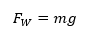
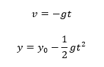
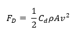
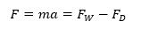
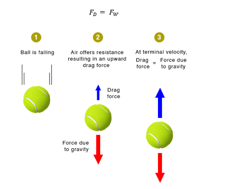

# THEORY
This experiment is an introduction to some of the basic concepts that influence the motion of an object when it falls down in a vacuum or a fluid (either a gas or a liquid).    

### Case I – Free Falling Object Under Gravity (no drag force)
An object that is falling through a vacuum is subjected to only one external force, the gravitational force. Such an object is called a free-falling object because the net external force is just the weight of the object. The motion of a free-falling object can be described by Newton's second law of motion.
 
			
Where m – mass of the object
	g – acceleration due to gravity
The gravitational acceleration decreases with the square of the distance from the center of the earth. However, for many practical problems, we can assume this factor to be a constant, which is generally taken as 9.8 m/s2 on the surface of the earth. Therefore, all free-falling objects, regardless of size, shape, or mass (or weight) will free-fall at the same rate. By measuring the velocity of the object at different intervals, one can experimentally determine the acceleration due to gravity. 

Since a free-falling object is at constant acceleration with an initial velocity is zero, the velocity and position of the object can be given by the equations

 

### Case II – Free Falling Object Under Gravity (no drag force)
If the object were falling through a fluid (either a gas or a liquid), there would be an additional drag force acting on the object. The drag force like friction, tends to oppose the motion of an object The vertical downward force due to gravity F_W  remains constant. However, the drag force is a complex entity that varies and largely depends upon the following factors.

	* Projected area of the object facing the fluid A- The area of the orthographic projection of the object on a plane perpendicular to the direction of fall/flow.
 
	*Velocity of the object v - When an object is moving at high velocity through air, the magnitude of the drag force is proportional to the square of the speed. As objects move faster, they encounter more drag.
 
	*Coefficient of drag C_d  - The drag coefficient is a dimensionless quantity that is used to quantify the drag or resistance of an object in a fluid environment. The drag coefficient is a function of several complex parameters like the shape of the body, the roughness of the surface, and fluid properties such as density, viscosity, velocity, and compressibility. The shape of an object has a very great effect on the coefficient of drag (airfoil shape has the lowest drag coefficient and the rectangular box has the highest). The important matching parameter for viscosity, velocity, and density that affects Cd is the Reynolds number which is used to characterize flow as laminar or turbulent. The drag coefficient can also depend upon velocity especially in cases when the object is traveling at high velocities (where it is related to the Mach number). In most cases, the coefficient of drag is determined empirically in a controlled environment such as a wind tunnel where we can set the viscosity, density, and area. In this experiment, we will assume that the coefficient of drag is a constant value.
 
	*Density of the fluid ρ - Lift and drag depend linearly on the density of the fluid. The air density affects the drag force explicitly through this proportionality and implicitly through the Reynolds number.
 
Taking into account all these factors, the drag force of a regular object at moderate speed may be given as 

 

Initially, when the object is released, it gains velocity due to acceleration due to gravity. But as the object moves faster, the drag force increases appreciably. This can be described by Newton’s second law of motion.

  
					    
Where FW – Weight of the body
	FD – Drag force experienced by the body
	m – Mass of the body
	a – acceleration of the body
A stage comes when the amount of upward air resistance force is equal to the downward gravity force and the object encounters a balance of forces. 

 
