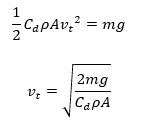
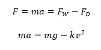
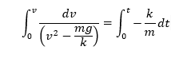
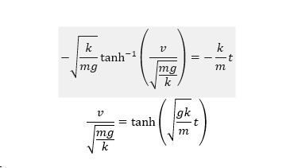
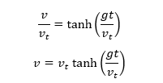
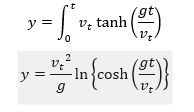
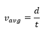

# THEORY
This experiment is an introduction to some of the basic concepts that influence the motion of an object when it falls down in a vacuum or a fluid (either a gas or a liquid).    

### Case I – Free Falling Object In Vaccum (no drag force)
An object that is falling through a vacuum is subjected to only one external force, the gravitational force. Such an object is called a free-falling object because the net external force is just the weight of the object. The motion of a free-falling object can be described by Newton's second law of motion.

  

 
			
Where m – mass of the object
	g – acceleration due to gravity
The gravitational acceleration decreases with the square of the distance from the center of the earth. However, for many practical problems, we can assume this factor to be a constant, which is generally taken as 9.8 m/s2 on the surface of the earth. Therefore, all free-falling objects, regardless of size, shape, or mass (or weight) will free-fall at the same rate. By measuring the velocity of the object at different intervals, one can experimentally determine the acceleration due to gravity. 

For a free-falling object with zero initial velocity, the position and velocity of the object at any time can be given by the equations

  

 

### Case II – Free Falling Object In Fluid (with drag force)
If the object were falling through a fluid (either a gas or a liquid), it would be subjected to two forces, the gravitational force and a drag force. The drag force, like kinetic friction, tends to oppose the motion of an object. The vertical downward force due to gravity, Fw remains constant. However, the drag force is a complex entity that varies and largely depends upon the following factors

* Projected area of the object facing the fluid A- The area of the orthographic projection of the object on a plane perpendicular to the direction of fall/flow.
 
* Velocity of the object v - When an object is moving at high velocity through air, the magnitude of the drag force is proportional to the square of the speed. As objects move faster, they encounter more drag.
 
* Coefficient of drag Cd  - The drag coefficient is a dimensionless quantity that is used to quantify the drag or resistance of an object in a fluid environment. The drag coefficient is a function of several parameters like the shape of the body, inclination, roughness of the surface, and fluid properties such as density, viscosity, velocity, and compressibility. The shape of an object has a very great effect on the coefficient of drag (airfoil shape has the lowest drag coefficient and cube has the highest). The drag coefficient can also depend upon velocity especially in cases when the object is traveling at high velocities (where it is related to the Mach number). In most cases, the coefficient of drag is determined empirically in a controlled environment such as a wind tunnel where we can set the viscosity, density, and area. Since the shape of the object plays a major role, we will assume a constant value for the coefficient of drag.
 
* Density of the fluid ρ - Lift and drag depend linearly on the density of the fluid. The air density affects the drag force explicitly through this proportionality and implicitly through the Reynolds number.
 
Taking into account all these factors, the drag force of a regular object at moderate speed may be given as 

  

  

Initially, when the object is released, it gains velocity due to acceleration due to gravity. But as the object moves faster, the drag force increases appreciably. This can be described by Newton’s second law of motion.

  

   
					    
Where FW – Weight of the body
	FD – Drag force experienced by the body
	m – Mass of the body
	a – acceleration of the body
A stage comes when the amount of upward air resistance force is equal to the downward gravity force and the object encounters a balance of forces. 

  

 

In other words, the vertical acceleration is zero and the object falls with constant velocity as described by Newton’s first law of motion. The constant vertical velocity is called the terminal velocity vt. 

The parameters used in this simulation correspond closely to typical real-world values observed in free-fall and drag-force studies. Table 1 below provides a summary of such reference values for better theoretical context.

| Parameter                                       | Symbol / Unit        | Typical Value / Range | Remarks / Context                                                                 |
|-------------------------------------------------|-----------------------|------------------------|------------------------------------------------------------------------------------|
| Acceleration due to gravity (at Earth’s surface) | g (m/s²)              | 9.80665               | Slightly varies with latitude and altitude (≈9.78 m/s² at equator, ≈9.83 m/s² at poles). |
| Air density (at 25°C, sea level)                | ρ_air (kg/m³)         | 1.184                 | Depends on temperature, humidity, and altitude.                                    |
| Water density                                   | ρ_water (kg/m³)       | 997.77                | Nearly constant at room temperature; used in simulation.                           |
| Glycerine density                               | ρ_glycerine (kg/m³)   | 1260                  | High-viscosity fluid commonly used for terminal velocity experiments.              |
| Drag coefficient for smooth sphere              | C_d                   | 0.45–0.50             | Matches the range used in the simulation (0.5–2.0).                                |
| Drag coefficient for cube / flat plate          | C_d                   | 1.05–1.15             | Strongly influenced by surface orientation and roughness.                           |
| Drag coefficient for streamlined body (airfoil shape) | C_d               | 0.04–0.10             | Used in aerodynamic and vehicle design studies.                                     |
| Terminal velocity of a 2 cm steel ball in air   | v_t (m/s)             | 15–20                 | Depends on mass, size, and air resistance.                                         |
| Terminal velocity of raindrops                  | v_t (m/s)             | 5–9                   | Varies with drop diameter (0.5–4 mm).                                              |
| Terminal velocity of human skydiver (belly-down) | v_t (m/s)            | ≈ 55                  | Can reach ≈ 120 m/s in head-first dive position.                                   |

The terminal velocity value is the final, constant velocity value achieved by the falling object.
The value of terminal velocity can be determined using the above equations

  

 

The velocity of the object before attaining the terminal velocity can also be determined mathematically from the equation

  

Where  k=1/2 CdρA = constant

  

Integrating both sides

  

  

Replacing √(mg/k)=√(mg/(1/2 Cd ρA))=vt, the above equation can be re-written as

  

The position of the object with an initial velocity of zero may be given as

  

### Experimental Setup
The experimental setup consists of 

•A custom-made long cylindrical glass jar of diameter 20 cm and height 2 meters to contain the vacuum/fluid through which the object is falling. The cylinder is attached to the bottom of an air-tight chamber that has an opening at the side to connect it to an industrial vacuum system and an opening at the base to drain the cylinder. 

•A rod stand with a solid base fixed outside the cylinder to clamp electromagnets and light gates at desired heights. 

•Electromagnet clamped to the rod stand and placed inside the top of the cylinder. The electromagnet connected to a power supply can hold or release a steel object by a switch. If the switch is set to the ‘on’ position, current flows in the electromagnet holding the object. If the switch is ‘off”, the object is released. The switch is also connected to a datalogger which activates the timer once the object is released. 

•Light gates clamped to the rod stand at definite intervals, each connected to the data logger. Light gates can measure the time a moving object takes to pass between them, allowing speed to be determined. If an object of size s cuts the light gate beam for time t, the average speed Vavg of the object during that time shall be given as

  

Light gates are used because of their accuracy. They can be set to react very quickly when the beam is broken which eliminates human reaction time errors. 

•Data logger which receives the inputs from light gates and is connected to a computer system which is programmed to show the timer when the object is released, the time when the object passes through each of the light gates and the time taken for the object to pass through a gate. 
 

  

The experiment may be used to determine the following parameters

•Acceleration due to gravity – The cylinder may be maintained in a vacuum to get accurate results or in air to get an approximate value.

•Coefficient of drag and terminal velocity of the object in a fluid – The object should be smaller in size and the fluid should have sufficient density so that the object may attain terminal velocity within the liquid column The sources of error in the above experiment include.

•The size of the object should be large enough to trigger the gate efficiently.

•The experiment can only be adopted for transparent liquids that do not absorb the light beam.

•The light beam is susceptible to reflection and refraction as it enters and leaves different materials (glass, fluid) which could cause false triggers.

•The size of the object and the density of the liquid used must ensure that the terminal velocity is obtained within the liquid column. Greater-sized objects and less dense fluids require a greater liquid column to achieve the terminal velocity. 

Note that the experiment may be performed without the use of light gates using the following two approaches

1. The entire experimental setup may be recorded using a camera that captures the fall of the object. The video can be processed using video analysis software that filters the position in each consecutive frame and plots velocity as a function of time.

2. For measuring the velocity of an object in vacuum or air, a motion sensor may be attached next to the electromagnet and connected to a data logger. This sensor directly records the position vs time graph.

3. A more crude approach can be adopted for measuring the velocity of objects in viscous liquids. In this approach, the experiment is performed manually by noting the time in a stopwatch when the object passes through a specific point marked by an elastic band. The time is noted from the beginning of release till it passes each of the bands. The time taken to travel between the consecutive bands may be used to determine the average velocity of the object in between the elastic bands

  

This approach may not be applicable for free falling objects in air/vacuum since the speed of the object will be very fast to note it using a stop-watch.

